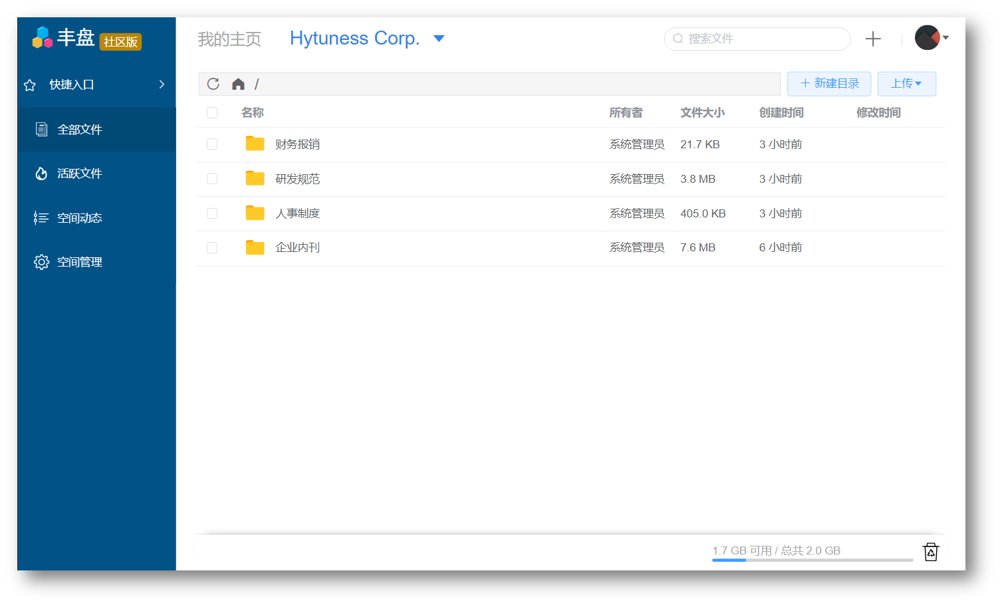
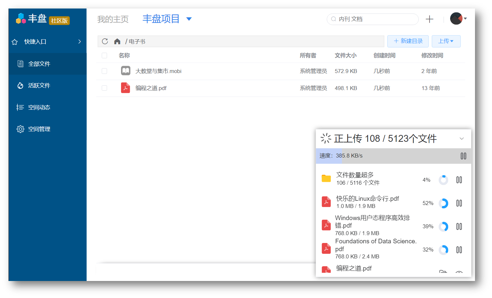
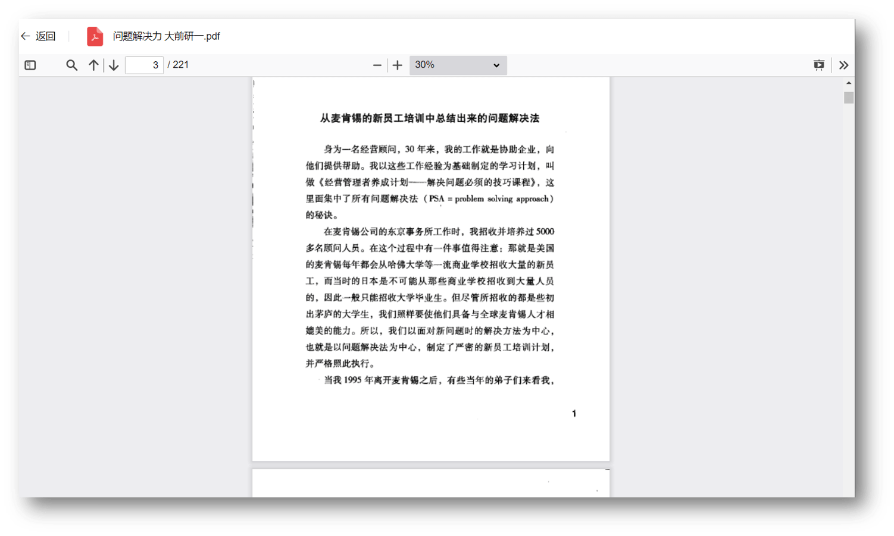
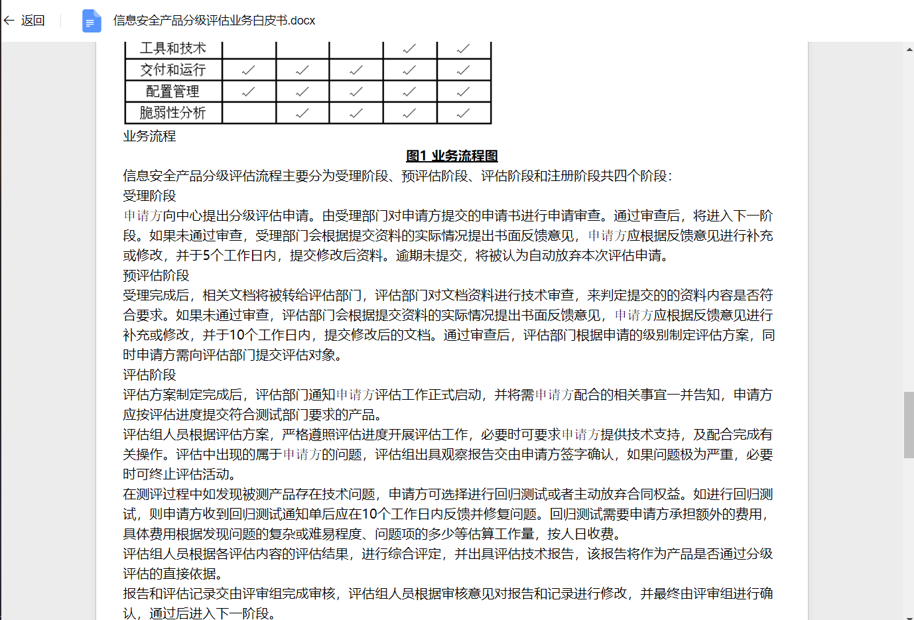
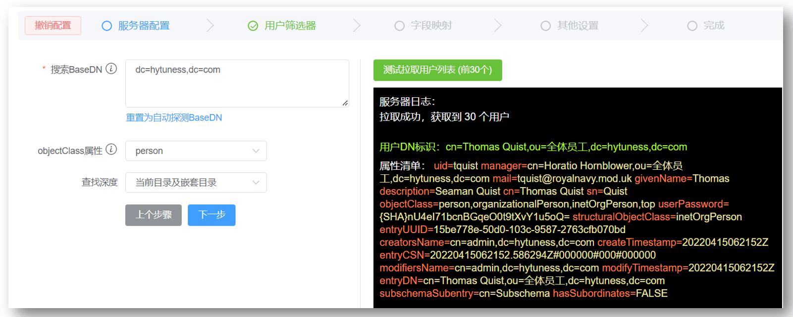
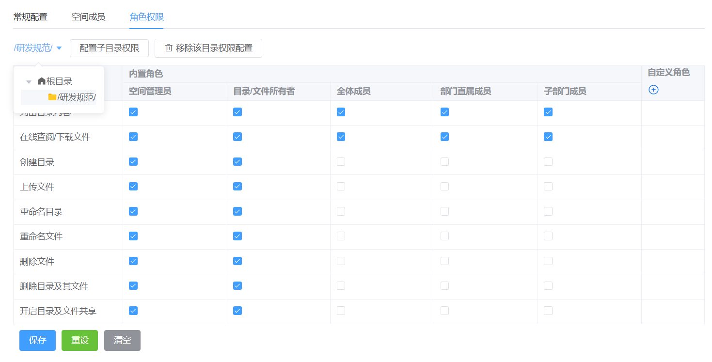
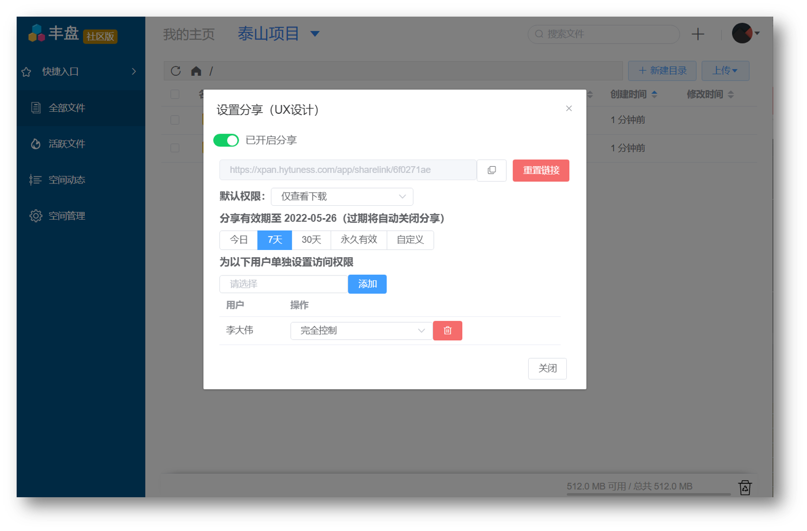

<h1 align="center">
    
  <br>
  丰盘ECM
</h1>
<h4 align="center">企业级私有文档协同管理系统</h4>
<h4 align="center">v1.6.4+220611 | <a href="https://ekbcloud.gitbook.io/xpan/changelogs">版本更新日志</a></h4>

## :information_source: 产品介绍

丰盘ECM软件（ [产品官网](https://xpan.ekbcloud.com/) ）是一款专注于 **企业客户需求**、只做**私有部署**、**可长期免费使用** 的企业网盘产品，可用于企业在自有IDC或公有云服务器上搭建私有的文档管理系统，积累核心知识资产，降低企业员工由于使用公有网盘不当导致的机密资料泄露风险。

## :question: 为什么要研发新的网盘产品

**知识传承** 永远是提升企业尤其是中小企业生存和竞争力的第一因素，但现实是多数企业内部知识分享者、创作者的比例远小于索取者，并且由于无法很好的量化知识管理带来的效益提升，企业也难以设计行之有效的激励制度，导致可持续性较差，很多企业最终也只是把文档通过行政手段强行集中起来，并没有形成有效的知识生产力。

市面上不管是传统的企业文档管理软件，还是互联网催生的网盘类产品，仍旧只是帮助企业做好“存储”和“分发”的工作，这是远远不够的，对此我们有一些新的想法，未来我们希望将这些想法通过多款知识工具类产品的创新和运营，能够帮助广大中小企业更加有效的、可持续的将知识转化成可量化的生产力，而网盘作为其中一款基础产品，则是一个开始。

## :sparkles: 产品优势

目前主流大厂提供的企业网盘产品均依托于自身的OA平台，如钉钉、企微、飞书等，无法实现独立部署或私有部署，对于重视数据安全、不希望把核心数据存放于第三方互联网平台的多数企业来说，支持私有化部署仍旧是他们选型网盘类产品的必要条件。而国内提供私有化部署的面向企业的网盘产品，多数不提供免费版本，甚至也没有公开透明的报价（部分兼做个人网盘、公有网盘的厂商只提供公共托管版本的报价）。国外开源的ownCloud/Nextcloud虽然支持私有部署，但在企业权限管理和协作功能上不太符合国内企业用户的使用习惯，更多被用于个人网盘的搭建上。

丰盘ECM的产品定位比较清晰，只做企业客户，只做私有部署，商业模式上采取国外企业级软件主流的Freemium模式，即**社区版永久免费+订阅版付费增值**，其中社区版 **不限人数、不限容量、永久免费**，满足企业的最基础的文档管理诉求；订阅版提供差异化的付费功能，满足企业高阶的需求。产品新特性会优先发布到付费订阅版，同时每年会定期解锁一部分特性到免费版，使到社区免费版的功能将越来越强大，也能反向促进我们将付费版做得更有竞争力。

总结来说，丰盘产品有如下差异化优势：

1. 社区版永久免费，且不限人数、不限容量；
2. 基于空间（个人空间、部门空间、项目空间）的文档组织和协作模式；
3. 支持按空间、按目录配置细粒度访问权限，以及灵活的即时分享权限；
4. 与国外同类开源产品相比，整体界面和交互设计更符合国内用户习惯；

## :gem: 界面速览

产品主界面，基于部门空间、项目空间和个人空间的文档组织方式和权限管理模式，清晰直观。



支持拖拽式批量高速上传、支持网络状况不佳或掉线情况下的断点续传



支持PDF、图片、视频、文档等几十种常见文档格式的在线预览。






支持Windows Active Directory和OpenLDAP进行用户同步和外部账号认证



支持RBAC模型，支持目录级的权限配置，方便空间管理员精细化管理每个不同项目的权限配置。



灵活易用、权限简化的即时分享，任意文件或目录右键直接一键分享给同事进行协作。




## 🚀 安装部署

**硬件要求**

1. 操作系统兼容主流Linux发行版，包括Redhat/Centos/Debian/Ubuntu；
2. 主流x86架构CPU型号，无其他特殊要求；
3. 系统内存最低 4GB，推荐8GB以上（内存直接影响了系统运行任务的性能）；
4. 网络带宽最低 4Mb/s，推荐20Mb/s（带宽直接影响文档上传下载的体验）；
5. 磁盘存储最低 10GB（后续可按需扩容）

**一键部署**

丰盘ECM软件采取DOCKER容器化技术安装，操作系统层面不需要预装任何软件， 脚本会自动检测DOCKER环境是否存在，如果不存在，则会自动安装DOCKER环境。

> 丰盘ECM软件安装脚本需要从DOCKER仓库源（ https://hub.docker.com/ ）拉取镜像， 国内多数城市实测访问速度尚可，如遇Network error、Timeout、超时等错误字样，可简单的重新运行脚本即可。

```sh
# 适用于内置curl的Linux发行版
sudo curl https://ota.xpan.ekbcloud.com/app/xpan-install.sh --output xpan-install.sh && sudo bash ./xpan-install.sh

# 适用于内置 wget 的Linux发行版
sudo wget https://ota.xpan.ekbcloud.com/app/xpan-install.sh -O xpan-install.sh && sudo bash ./xpan-install.sh
```

**免费注册获取授权码**

系统安装成功根据提示访问系统首页，输入超级管理员的初始临时密码， 按系统要求重置密码之后会弹出输入许可证激活的窗口。访问 [丰盘许可证站点 (ekbcloud.com)](https://ota.xpan.ekbcloud.com/app/)， 使用您的企业邮箱注册并获得丰盘社区版的许可证，然后从邮箱中获取许可证填入丰盘ECM系统激活即可。

> 丰盘产品仅面向企业用户开放，不支持使用 163.com/qq.com/gmail.com 等个人邮箱注册，需要使用您的企业邮箱注册， 后续的产品更新、许可证管理等均绑定此注册邮箱。

## 相关链接

- [产品官网](https://xpan.ekbcloud.com/) 
- [产品帮助手册](https://ekbcloud.gitbook.io/xpan/)
- [功能建议/技术支持](https://xpan-ekbcloud.canny.io/features)
- [版本更新日志](https://ekbcloud.gitbook.io/xpan/changelogs)
