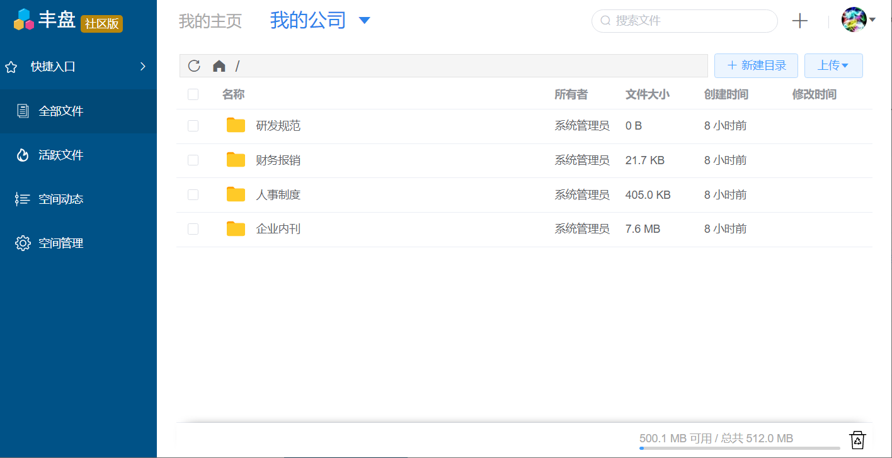
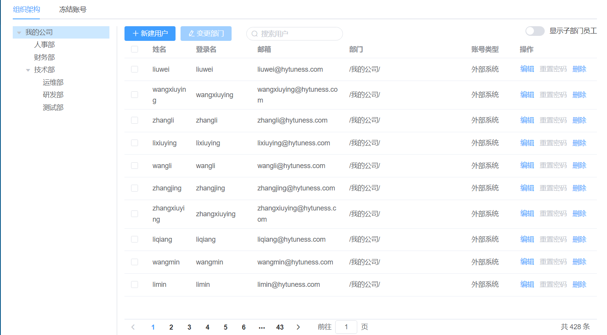
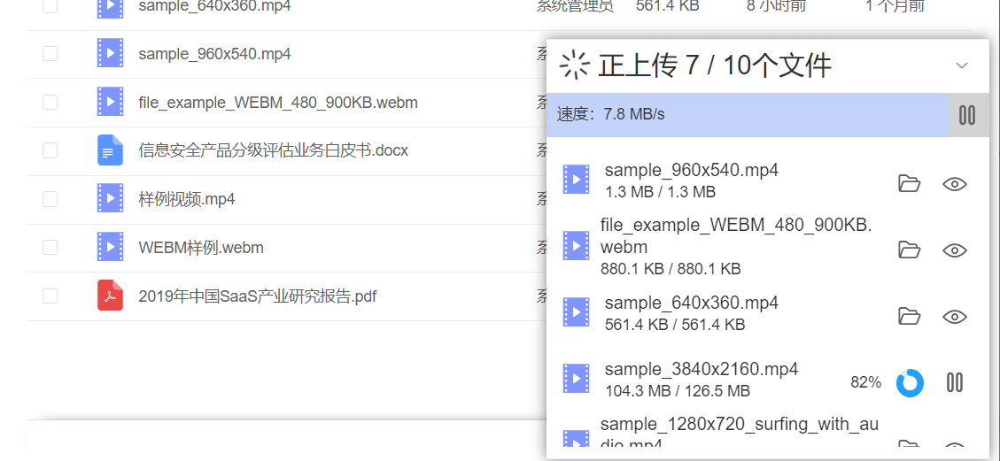
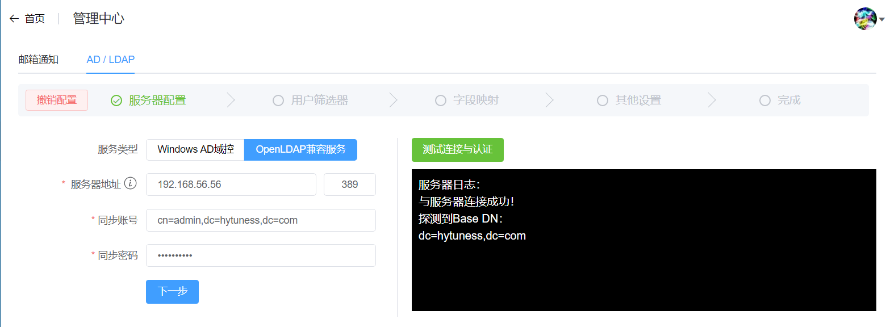

# 丰盘 - 企业级私有文档协同管理系统

丰盘是一款面向企业的支持私有部署的网盘产品，可用于企业在自有IDC或公有云服务器上搭建专有的文档管理系统，积累核心知识资产，降低由于使用公有网盘不当导致的机密资料泄露风险。

相较于公有网盘，自建企业私有文档管理系统的优势有几个：

1. 核心文档资产安全性较高，降低资料泄露风险；
2. 能够更好的和现有内部IT系统进行有机整合；
3. 更加灵活自主的容量和带宽控制；

丰盘产品采取 **社区版永久免费+订阅付费增值** 的模式，其中社区版 **不限人数、不限容量、永久免费**。产品新特性会优先发布到付费版，同时每年会定期解锁一部分特性到免费版，使到社区免费版的功能将越来越强大，也能反向促进我们将付费版做得更有竞争力。

## 安装部署

**硬件要求**

1. 操作系统兼容主流Linux发行版，包括Redhat/Centos/Debian/Ubuntu；
2. 主流CPU型号，无特殊要求；
3. 系统内存最低 4GB，推荐8GB以上（内存直接影响了系统运行任务的性能）；
4. 网络带宽最低 4Mb/s，推荐20Mb/s（带宽直接影响文档上传下载的体验）；
5. 磁盘存储最低 10GB（后续可按需扩容）

**一键部署**

登录服务器shell命令行，执行以下命令行：

```sh
# 适用于内置curl的Linux发行版
sudo curl https://ota.xpan.ekbcloud.com/app/xpan-install.sh --output xpan-install.sh && sudo bash ./xpan-install.sh

# 适用于内置 wget 的Linux发行版
sudo wget https://ota.xpan.ekbcloud.com/app/xpan-install.sh -O xpan-install.sh && sudo bash ./xpan-install.sh
```

**免费注册获取授权码**

访问网站 [免费注册丰盘产品 (ekbcloud.com)](https://ota.xpan.ekbcloud.com/app/) ，使用企业邮箱注册并获得社区版的许可证。

## 产品优势

相较于市面上的其他免费私有网盘产品，丰盘产品有如下特点：

1. 社区版永久免费，且不限人数、不限容量；
2. 基于空间（个人空间、部门空间、项目空间）的文档组织和协作模式；
3. 支持按空间、按目录配置细粒度访问权限，以及灵活的即时分享权限；
4. 与国外同类开源产品相比，整体界面和交互设计更符合国内用户习惯；

## 界面截图

根据部门结构及成员关系自动创建相对应的部门级共享协作空间，并自动维护部门成员的角色权限。





支持拖拽式批量高速上传、支持网络状况不佳或掉线情况下的断点续传



支持PDF、图片、视频、文档等几十种常见文档格式的在线预览。


支持Windows Active Directory和OpenLDAP进行用户同步和外部账号认证




支持RBAC模型，支持目录级的权限配置


灵活易用、权限简化的即时分享

